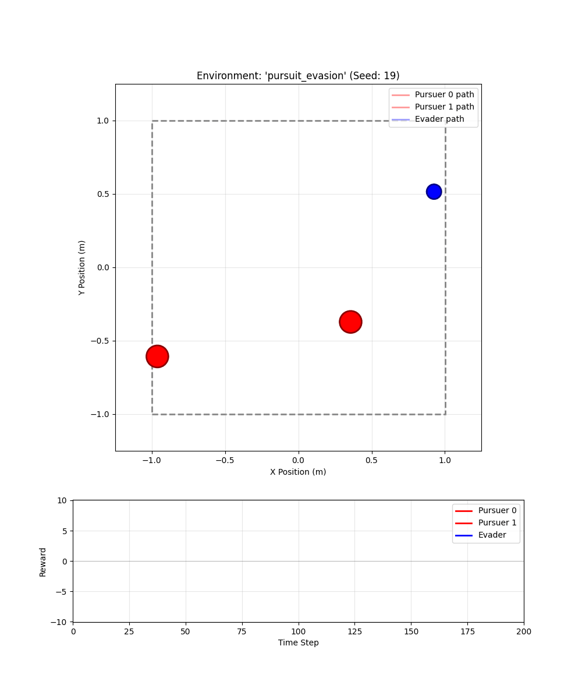

# ⚠️ MAX: A JAX-based **Research** Library for Online RL ⚠️

**MAX** is an **experimental** reinforcement learning library built on JAX. It is primarily designed for research in **online adaptation** and **information-gathering** in reinforcement learning.

## Features

- **Pure JAX Implementation**: Leverage JIT compilation, automatic differentiation, and GPU/TPU acceleration for fast iteration.
- **Emphasis on Online Adaptation**: Core design centers around algorithms and components for efficient **adaptation to changing or uncertain dynamics**.
- **Model-Based Algorithms with Parameter Belief**: Supports model-based control where the dynamics components **maintain a distribution or belief over uncertain parameters** (e.g., in a Bayesian context).
- **Multi-Agent RL**: Built-in support for IPPO (Independent PPO) and multi-agent environments.
- **Modular Design**: Mix and match components (environments, policies, trainers, normalizers) for rapid prototyping of novel online algorithms.

## Installation

### From source

```bash
git clone <repository-url>
cd max
pip install -e .
```

## Dependencies

Core (installed via pip):
- `jax`, `jaxlib` - Core framework
- `flax` - Neural network definitions
- `optax` - Optimizers
- `numpy`, `scipy`, `matplotlib`

Optional:
- `wandb` - Experiment tracking (`pip install -e ".[wandb]"`)

## Library Structure

### Core Modules

- **`environments`**: Multi-agent tracking and pursuit-evasion environments
- **`dynamics`**: Learned dynamics models (MLP-based, analytical models)
- **`policies`**: Actor-critic policies and model-based planners
- **`policy_trainers`**: PPO and IPPO training algorithms
- **`dynamics_trainers`**: Dynamics model training (gradient descent, EKF, PETS)
- **`normalizers`**: State/action/reward normalization utilities
- **`buffers`**: JAX-based replay buffers for efficient data storage
- **`planners`**: Model-based planning algorithms (CEM, iCEM)
- **`policy_evaluators`**: Policy evaluation and rollout utilities
- **`evaluation`**: Dynamics model evaluation metrics

### Auxiliary Modules

- **`estimators`**: Extended Kalman Filter for online Bayesian optimization

## Examples

### Pursuit-Evasion

<div style="text-align: center;">
  
  <p style="text-align: center; font-style: italic;">
    <strong>Figure 1:</strong> Multi-agent pursuit-evasion policy
  </p>
</div>

- **`scripts/ippo_pe.py`**: Train IPPO agents on pursuit-evasion task

- **`scripts/visualize_pe.py`**: Visualize trained policies

### Multi-Agent Goal Tracking

<div style="text-align: center;">
  
  <p style="text-align: center; font-style: italic;">
    <strong>Figure 2:</strong> Multi-agent goal tracking with dynamic target switching
  </p>
</div>

- **`scripts/ippo_tracking.py`**: Train IPPO agents for goal tracking
- **`scripts/visualize_tracking.py`**: Visualize trained tracking policies

### LQR Online Learning

Run the online dynamics learning experiment:
```bash
python scripts/run_lqr.py --run-name "my_exp" --num-seeds 1
```

Requires config at `configs/lqr.json`.

## Using the LQR Example as a Template

The LQR experiment (`scripts/run_lqr.py`) demonstrates all core components. Use it as a starting point for custom environments.

### Config (`configs/lqr.json`)
All experiment parameters: environment, dynamics, trainer, planner, cost function.

### Dynamics (`max/dynamics.py`)
Defines how states evolve. Key interface:
```python
class DynamicsModel(NamedTuple):
    pred_one_step: Callable[[params, state, action], next_state]
```

Reference implementation: `create_pursuit_evader_dynamics()` (line 268)
- State: 8D (evader pos/vel, pursuer pos/vel)
- Action: 2D (evader acceleration)
- Pursuer uses embedded LQR controller with learnable Q, R matrices

### Cost Function (`max/costs.py`)
Defines the objective to minimize. Signature:
```python
cost_fn(init_state, controls, cost_params) -> scalar
```

Must handle trajectory rollout internally. See `init_cost()` and `make_info_gathering_cost()`.

Key parameters in config: `cost_type`, `cost_fn_params` (weights for control, info, jerk).

### Environment (`max/environments.py`)
Wraps dynamics into reset/step functions. See `make_pursuit_evasion_lqr_env()` (line 407).

Factory: `init_env(config)` returns `(reset_fn, step_fn, get_obs_fn)`.

### Planner (`max/planners.py`)
Optimizes action sequences using learned dynamics. See `init_planner()`.

Uses iCEM (improved Cross-Entropy Method) by default.

### Creating Your Own Environment

1. **New dynamics**: Add to `dynamics.py` following `DynamicsModel` interface
2. **New cost**: Add to `costs.py`, wire into `init_cost()`
3. **New environment**: Add to `environments.py`, wire into `init_env()`
4. **New config**: Create JSON in `configs/`
5. **New script**: Copy `run_lqr.py` and modify as needed

## License

MIT License
